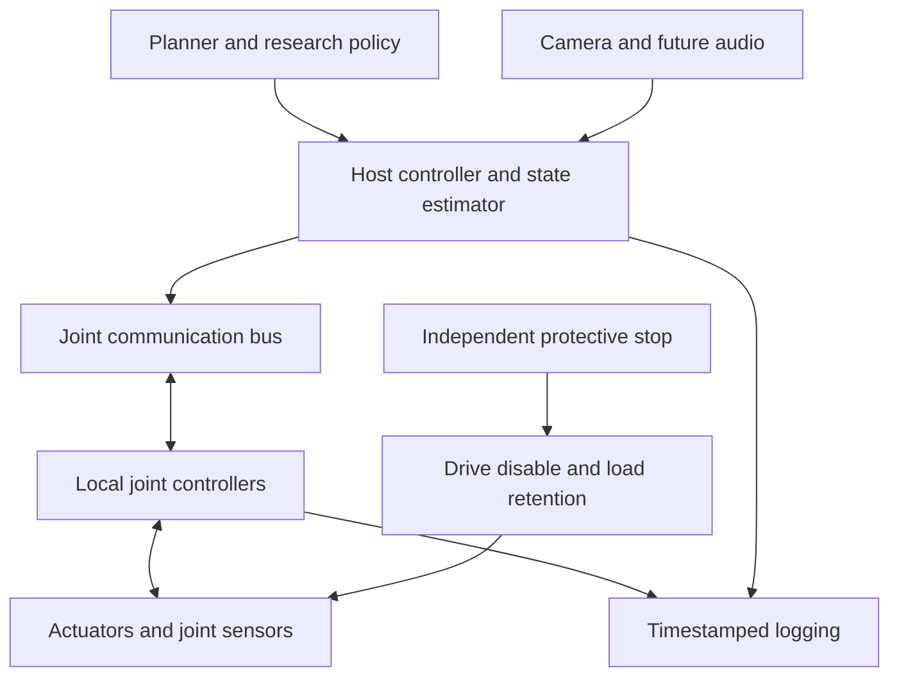

# System architecture — proposal

## Functional structure

## Mechanical

Candidate arrangement: shoulder yaw, shoulder pitch, upper-arm roll, elbow pitch, forearm roll, wrist pitch and tool-axis roll. This is an independent 7R proposal, not a statement of Atlas kinematics. Define actual local axes, offsets, zero positions and limits in CAD before creating a validated robot model. Compare manipulability, collisions, mass and costs against 6R.

Use at least two actuator size classes: high-load proximal joints and lighter distal joints. Standardize module interfaces where practical; identical motors everywhere would add unnecessary distal mass. Specify output bearings for combined radial/axial/moment loads independently of gearbox torque rating.

## Local electronics

Each joint module contains or connects to a BLDC drive, encoder(s), temperature sensing and a local controller. An integrated motor drive may already provide the required processor: an additional MCU per module is not inherently necessary. Local electronics close fast motor loops, enforce local limits and reject stale commands. The host sends time-bounded setpoints and receives state/fault telemetry.

Distributed control reduces point-to-point signal wiring. It does not eliminate power conductors, return paths, shielding, protective circuits or the need for rotary interconnects at continuously rotating axes.

CAN-FD is the first communication candidate for a small prototype. EtherCAT remains an alternative if synchronization and throughput requirements justify its complexity. Neither is selected until candidate drives, worst-case traffic, timing and connector compatibility are reviewed. Ordinary bus messaging is not assumed to implement a certified safety function.

## Control hierarchy

Draft design-study ranges only: local current loops in the kHz range; joint/host control roughly 250–1000 Hz where hardware supports it; high-level planning slower; research camera updates varied from initial-only through 2 Hz to a frequent-vision baseline. Vendor-supported rates, jitter and stability tests determine actual values. Keep control, sensor, camera acquisition, encoder inference and policy frequencies separate.

Start with bounded position/velocity control, then gravity compensation and impedance experiments after torque estimation is calibrated. Learned policies remain behind deterministic command limits and timeout handling.

## Power and sensing

Select bus voltage after motor winding, driver, encoder, brake and power-supply review. Include branch protection, rated connectors, a regenerative-energy strategy and orderly shutdown/load retention. A DC supply must not be assumed able to absorb regeneration.

Begin with joint position, current and temperature. Evaluate output encoders and a reference load cell for the joint test. A later wrist force/torque sensor is desirable for research but must fit the mass budget. Current-based torque inference includes transmission, friction, acceleration and thermal errors.

## Rotation

Continuous roll is a design goal under evaluation. For V1 joint testing, bounded travel and a replaceable harness isolate the actuator/control problem. A later rotary interconnect variant must pass power, data integrity, mechanical and endurance tests; see 04-joints-and-rotation.md.
